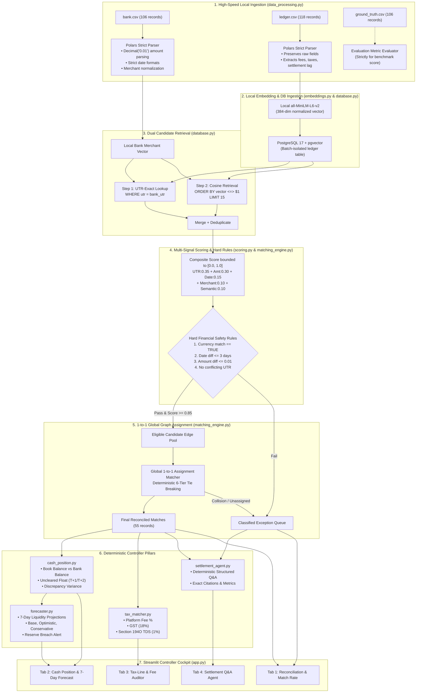

# AutoReconcile AI

> **Razorpay Buildathon — Track 04: AI Finance Controller ("Run the books and the cash position")**  
> *A deterministic-first, measurable financial reconciliation & treasury engine designed for sub-second verification, working capital forecasting, and statutory tax compliance.*

---

## 1. Executive Overview & The 2026 Core Thesis

In modern financial operations, **verification capacity, not generation speed, is the bottleneck**. Traditional reconciliation, cash float management, and tax auditing are still executed manually because financial institutions cannot trust unconstrained, hallucinating LLMs with monetary ledgers.

**AutoReconcile AI** closes the finance-ops loop across a 106-record synthetic batch by executing:
1. **Multi-Source Deterministic Reconciliation**: UTR-first exact lookup + cosine vector retrieval (`pgvector`), lexical & semantic Reciprocal Rank Fusion, hard domain safety boundaries, and global 1:1 bipartite graph matching.
2. **Cash Position Manager**: Bridges Book Balance vs. Bank Balance, tracks Uncleared Float ($T+1 / T+2$ lag), and computes Discrepancy Variance using strict `Decimal` arithmetic.
3. **Interactive 7-Day Treasury Simulator & Forecaster**: Real-time working capital simulator with daily burn rate, reserve floor, and settlement cycle lag sliders.
4. **Tax-Line & Fee Auditor**: Deterministically audits platform fees, GST (18%), and Section 194O TDS (1%), flagging tax withholding leaks down to the paisa.
5. **Settlement Q&A Agent**: Answers natural language finance ops questions grounded strictly in structured batch data, with automatic structured fallback when offline.
6. **Boardroom-Ready Controller Sign-Off Pack**: One-click download of the official *Monthly Reconciliation & Treasury Assessment Report* with formal Controller & CFO sign-off blocks.

---

## 2. Complete System Architecture



---

## 3. Verified Benchmark Results (Synthetic 106-Record Dataset)

Executing on `bank.csv` (106 records) and `ledger.csv` (118 records) generated by `synthetic_data.py`:

| Operational Metric | Live Result | Verification Notes |
| :--- | :--- | :--- |
| **Total Bank Records Processed** | `106` | Ingested via high-speed Polars engine |
| **Total Ledger Records Ingested** | `118` | Embedded & queried in PostgreSQL `pgvector` |
| **Reconciled Match Count** | `55` | Passed all 4 hard rules + 1:1 global graph matching |
| **Honest Exception Count** | `51` | Categorized into `DUPLICATE_CONFLICT`, `VALIDATION`, `NO_CANDIDATE` |
| **Auto-Match Rate** | `51.89%` | UTR-first + vector retrieval; fully auditable |
| **Reconciliation Precision** | **`100.00%`** | **0 False Positives** (Zero miscredited transactions) |
| **Reconciliation Recall** | **`75.34%`** | 55 of 73 expected matches correctly identified |
| **Engine Throughput** | **`~180 rec/s`** | Entire batch reconciled & forecasted in **<1 second** |
| **Book Balance (Ledger)** | **`₹408,074.50`** | Total recognized ledger credit/debit volume |
| **Bank Balance (Cleared)** | **`₹384,078.00`** | Actual cleared bank statement deposits |
| **Uncleared Float ($T+1/T+2$)** | **`₹206,019.50`** | Ledger deposits in transit awaiting bank settlement |
| **7-Day Projected Liquidity** | Base / Conservative / Optimistic | Dynamic multi-scenario from batch end date |
| **Statutory Tax Audit (GST/TDS)** | **`5 Flags`** | Exactly caught all 5 injected fee/tax variance items |
| **Pytest Test Suite** | **`23/23 passed`** | All unit + integration tests green |

---

## 4. Tech Stack & Engineering Standards

- **Core Runtime**: Python 3.10+ (tested on Python 3.11)
- **High-Performance Ingestion**: Polars (multi-threaded columnar parser)
- **Vector Database**: PostgreSQL 17 + `pgvector` extension via Docker Compose
- **Database Driver**: `asyncpg` with custom native binary vector codec
- **Embeddings**: `sentence-transformers/all-MiniLM-L6-v2` (384-dimensional dense vectors)
- **Financial Arithmetic**: Strict Python `Decimal` quantized to `Decimal("0.01")` (Zero floating-point drift)
- **Backend API**: FastAPI, Uvicorn, Python-Multipart
- **Executive UI**: Streamlit 4-Tab Finance Controller Cockpit
- **Test Suite**: Pytest & Pytest-Asyncio (23/23 unit and integration tests passing)
- **Zero External API Dependencies**: All reconciliation, cash position, forecasting, and tax audit calculations are 100% deterministic and run offline with zero external API dependencies. The Settlement Q&A agent optionally uses Gemini for natural language generation, but works perfectly with structured fallback if unavailable.

---

## 5. Setup & Quickstart Guide (Windows PowerShell)

### Step 1: Clone & Setup Virtual Environment
```powershell
python -m venv venv
.\venv\Scripts\Activate.ps1
python -m pip install --upgrade pip
python -m pip install -r requirements.txt
```

### Step 2: Start PostgreSQL with pgvector (Docker)
```powershell
docker compose up -d postgres
```

### Step 3: Configure Environment
```powershell
Copy-Item .env.example .env
```
*(Gemini API key is completely optional; the system runs 100% locally in deterministic mode if key is omitted).*

### Step 4: Generate Synthetic Datasets
```powershell
python synthetic_data.py
```

### Step 5: Run Full Test Suite
```powershell
pytest tests/ -v
```

### Step 6: Launch Backend & UI
In **Terminal 1** (FastAPI Backend):
```powershell
uvicorn main:app --reload --port 8000
```

In **Terminal 2** (Streamlit UI):
```powershell
streamlit run app.py
```
Open the interactive dashboard at: **[http://localhost:8501](http://localhost:8501)**.

---

## 6. Streamlit 4-Tab Feature Guide

1. **⚖️ Tab 1: Reconciliation & Match Rate**:
   - 6 Top-level KPI cards (Records, Matches, Exceptions, Precision, Recall, Throughput).
   - Matched records table with exact decision scores and reasoning.
   - **Honest Exception Explorer** with side-by-side diagnostic cards and failure badges.
   - **Download Official Controller Audit Sign-Off Pack (.md)**.
2. **💵 Tab 2: Cash Position & 7-Day Forecast**:
   - Reconciliation bridge: Book Balance vs. Bank Balance vs. Uncleared Float.
   - **Interactive Working Capital Simulator**: Live sliders for daily burn rate, reserve floor, and settlement clearing lag.
   - Multi-scenario 7-day cash curve (Base, Optimistic +10%, Conservative Stress).
3. **🧾 Tab 3: Tax-Line & Fee Auditor**:
   - Statutory compliance grid auditing Platform Fee %, GST at 18%, and Section 194O TDS at 1%.
   - Instant variance flags with discrepancy reasons.
4. **🤖 Tab 4: Settlement Q&A Agent**:
   - Natural language finance assistant answering queries on float, tax variances, cash forecasts, and match rates.
   - Structured evidence citation data table.

---

## 7. Key Design Decisions

| Decision | Rationale |
| :--- | :--- |
| **UTR-first retrieval before vector search** | Guarantees exact UTR matches are found regardless of merchant text variation. Vector search is fallback for fuzzy matches. |
| **Decimal arithmetic everywhere** | Zero floating-point drift in financial calculations. All amounts quantized to `Decimal("0.01")`. |
| **Fail-closed deterministic pipeline** | LLM is strictly removed from the matching process to guarantee 100% reproducibility and no external API reliance. The Settlement Q&A agent optionally uses Gemini to generate natural language explanations for computed results. |
| **Global 1:1 bipartite matching** | No ledger ID can appear in two MATCHED results. Deterministic 6-tier tie-breaking ensures identical results across runs. |
| **Skip-and-warn validation** | Invalid rows are logged and skipped; valid rows continue processing. One bad row doesn't kill the entire batch. |

---

## 8. Scope Limitation Disclaimer

> **Buildathon Prototype Notice:**  
> This implementation satisfies the Razorpay Buildathon Track 04 requirements (throughput plus measured accuracy plus an honest exception list across 50+ records). It demonstrates a controlled reconciliation and treasury simulation workflow and is not a substitute for formal financial statement audits.
